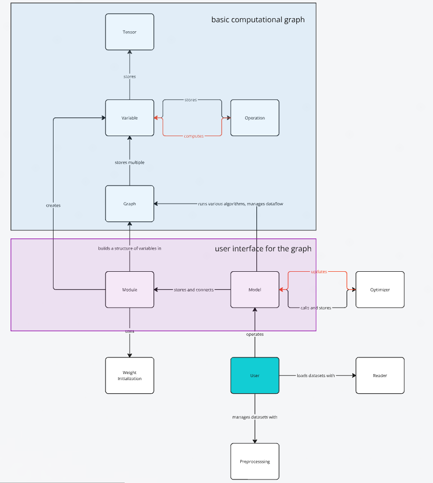


# Brainet

Brainet is a deep learning engine developed in C++ and CUDA, without relying on external libraries. Its primary goal is to offer a transparent framework that allows users to fully understand the underlying mechanisms. Unlike alternatives such as TensorFlow, PyTorch, or Caffe, which often feel like black boxes due to their high level of abstraction, Brainet focuses on explaining how everything works under the hood.

To achieve this, Brainet features a simple, well-documented codebase. Additionally, a small book will be available to explain the design choices and mechanisms of Brainet and deep learning in general.

Please note that the project is still in its early stages of development. As a result, the codebase might be challenging to understand, and the supporting book is not yet written. However, I am actively working on it and am happy to provide explanations if you reach out to me. 😊

Currently, the best place to start is the example.cpp file, which contains a simple example of how to train a 2-layer neural network on the MNIST dataset.

## Overview 
The following image shows a high-level overview of the Brainet architecture:



## Performance

- [MNIST](https://yann.lecun.com/exdb/mnist/): 

    | Model | Test Error Rate | Training Time |
    |-------|----------|---------------|
    | 2-layer NN, 300 hidden units, cross-entopy | 8.66% | 30 min |
    

## Installation

<!-- To use Brainet, you need to have a CUDA compatible GPU and the [CUDA Toolkit](https://developer.nvidia.com/cuda-downloads) installed. -->

You'll need a C++ compiler that supports at least C++17. I recommend using the [GNU Compiler Collection](https://gcc.gnu.org/). (And git to download the source code.)

To download, run the following command in your terminal:

```bash
  git clone https://github.com/Neurologism/brainet
```

## Usage
To use Brainet, you need to include the Brainet header file in your project. 
```cpp
#include "brainet.h"
```

An example of how to train a 2-layer Neural Network on the MNIST dataset can be found in the example.cpp file.

To compile the example file run the following command in your terminal:
```bash
g++ -o example example.cpp -std=c++17 -O3
```

To run the compiled file, run the following command in your terminal:

```bash
./example
```

The algorithm will print logs to the console, showing the training progress. After the training is done, the test error rate will be printed to the console.

## Extensions
The only dataset that comes with Brainet is the MNIST dataset. 
The following contains a list of download links for other datasets that can be used with Brainet:
- [EMNIST](https://biometrics.nist.gov/cs_links/EMNIST/gzip.zip)
- Fashion MNIST: 
    - [Train](http://fashion-mnist.s3-website.eu-central-1.amazonaws.com/train-images-idx3-ubyte.gz)
    - [Test](http://fashion-mnist.s3-website.eu-central-1.amazonaws.com/t10k-images-idx3-ubyte.gz)
- [CIFAR-100](https://www.cs.toronto.edu/~kriz/cifar-100-binary.tar.gz)
- [CIFAR-10](https://www.cs.toronto.edu/~kriz/cifar-10-binary.tar.gz)

To use them, you will also need a tool to extract gzip and tar files. I recommend using [7-Zip](https://www.7-zip.org/).

## Authors

- [@Servant-of-Scietia](https://github.com/Servant-of-Scietia)

## Feedback
Feedback is greatly appreciated. If you have any questions or suggestions, please feel free to reach out to me.
If you find a bug or have a feature request, please open an issue on GitHub.
